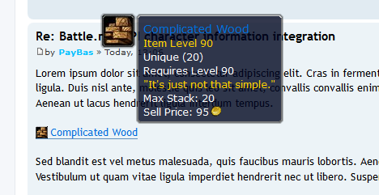

Game Tooltips for phpBB 3.1
==========

Extension for phpBB 3.1 that adds tooltip scripts for various games to your forum.

## Features
- ACP module where you can enable/disable various script providers.
- Setting for regional preference control.
- Support for the following games:
  - World of Warcraft
  - HearthStone
  - Diablo 3 + expansions
  - WildStar
  - League of Legends
  - Everquest (1 & 2)
  - Final Fantasy (XI & XIV)
  - LotR Online
  - Warhammer Online

#### Requirements
- phpBB 3.1-RC3 or higher
- PHP 5.3.3 or higher

#### Languages supported
- English
- Spanish

## Installation
1. [Download the latest release](https://github.com/PayBas/GameTooltips/releases) and unzip it.
2. Copy the entire contents from the unzipped folder to `phpBB/ext/paybas/gametooltips/`.
3. Navigate in the ACP to `Customise -> Manage extensions`.
4. Find `Game Tooltips` under "Disabled Extensions" and click `Enable`.

## Uninstallation
1. Navigate in the ACP to `Customise -> Manage extensions`.
2. Click the `Disable` link for `Game Tooltips`.
3. To permanently uninstall, click `Delete Data`, then delete the `gametooltips` folder from `phpBB/ext/paybas/`.

### License
[GNU General Public License v2](http://opensource.org/licenses/GPL-2.0)

© 2014 - PayBas